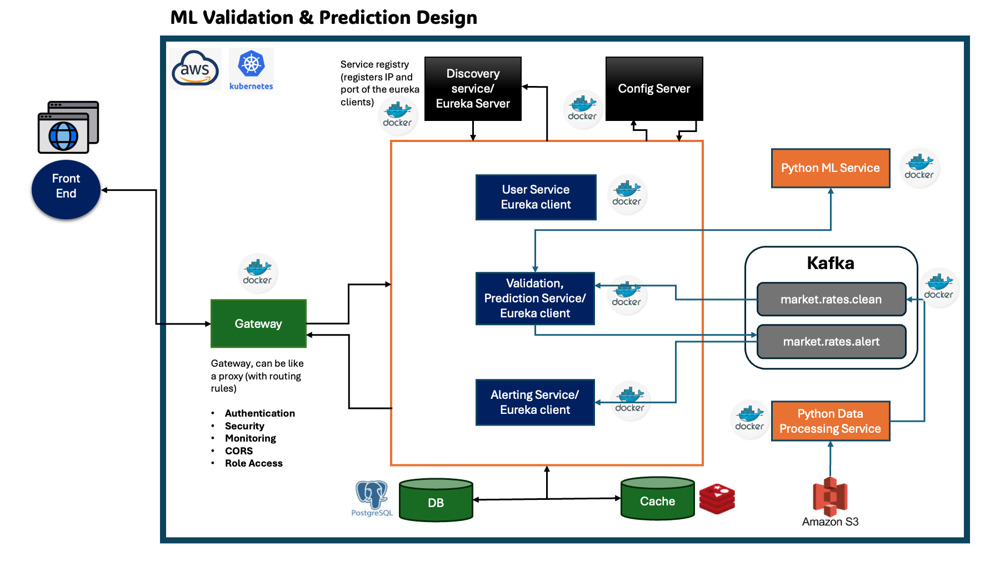

# MarketGuard — ML Market Data Validation & Prediction System

## Overview

MarketGuard is a cloud-native, machine learning-driven framework for
automated market data validation and prediction. The system validates
incoming financial market rates in real time using an ensemble of
supervised, unsupervised, and self-supervised ML models — flagging
anomalies and publishing alerts via Apache Kafka.

---

## Frontend

The frontend is built using **React 19** and served via **Nginx** in
production. It provides a real-time dashboard for monitoring instrument
status, validating rates, and viewing anomaly alerts.

### Screens
- **Dashboard** — instrument status, recent alerts, model performance
- **Validate Rate** — real-time single rate validation across all 3 models
- **Historical Analysis** — anomaly history and trends per instrument
- **Model Performance** — detailed metrics, R² and F1 scores
- **Alerts** — full alert history with severity filtering
- **Settings** — instrument and threshold configuration

### Running Locally

```bash
cd market-data-system-ui
npm install
npm start
```

Open at `http://localhost:3000`

---

## System Architecture



---

## Services

| Service | Language | Port |
|---|---|---|
| API Gateway | Java Spring Boot | 8082 |
| User Service | Java Spring Boot | 8081 |
| Validation & Prediction Service | Java Spring Boot | 8080 |
| Alerting Service | Java Spring Boot | 8083 |
| Python ML Service | Python FastAPI | 8000 |
| Python Preprocessing Service | Python | — |
| MarketGuard UI | React + Nginx | 80 |

---

## ML Models

| Layer | Model | Paradigm |
|---|---|---|
| Prediction | Linear Regression | Supervised |
| Prediction | Gradient Boosting Regressor | Supervised |
| Prediction | Random Forest Regressor | Supervised |
| Validation | K-Means Clustering | Unsupervised |
| Validation | Autoencoder | Self-Supervised |
| Validation | Random Forest Classifier | Supervised |

---

## Container Registry

Images are hosted on GitHub Container Registry:

---

## Local Kubernetes Setup (Minikube)

### Prerequisites
- Docker Desktop running
- Homebrew installed
- `kubectl` installed — `brew install kubectl`

### Step 1 — Start Cluster

```bash
brew install minikube
minikube start --cpus=4 --memory=4096
kubectl get nodes
```

### Step 2 — Install ArgoCD

```bash
kubectl create namespace argocd

kubectl apply -n argocd \
  -f https://raw.githubusercontent.com/argoproj/argo-cd/stable/manifests/install.yaml \
  --server-side \
  --force-conflicts

kubectl wait --for=condition=Ready pods --all -n argocd --timeout=120s
```

### Step 3 — Access ArgoCD UI

```bash
kubectl port-forward svc/argocd-server -n argocd 8080:443

kubectl -n argocd get secret argocd-initial-admin-secret \
  -o jsonpath="{.data.password}" | base64 -d
```

Open `https://localhost:8080` — username: `admin`

> ⚠️ Change the admin password after first login

### Step 4 — Access MarketGuard UI

```bash
kubectl port-forward svc/marketguard-ui -n marketguard 3000:80
```

Open `http://localhost:3000`

### Step 5 — Stop / Resume Cluster

```bash
minikube stop    # stop
minikube start   # resume
minikube delete  # delete completely
```

---

## Production Deployment (AWS)


> Phase 2 — Bloomberg Terminal high-frequency data evaluation

---

## Tech Stack

| Layer | Technology |
|---|---|
| Frontend | React 19, Nginx |
| Backend | Java 24, Spring Boot 3.x |
| ML Service | Python FastAPI, scikit-learn, TensorFlow |
| Messaging | Apache Kafka |
| Database | PostgreSQL |
| Cache | Redis |
| Auth | JWT |
| Containerisation | Docker |
| Orchestration | Kubernetes (Minikube / k3s) |
| GitOps | ArgoCD |
| Registry | GitHub Container Registry (ghcr.io) |
| Build | Maven, npm |